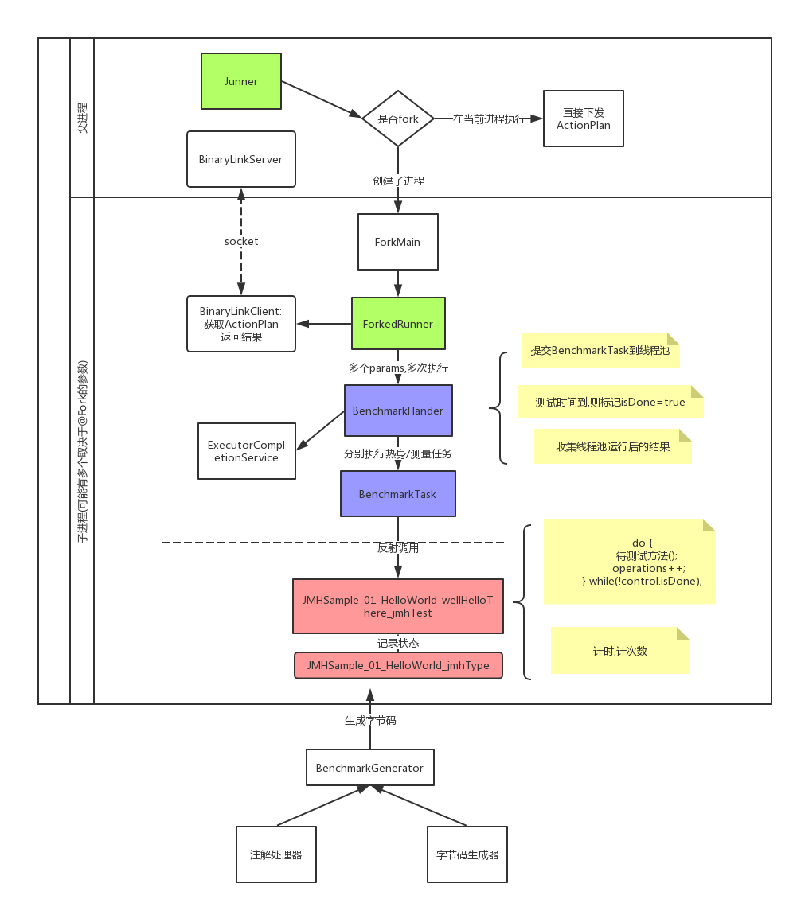
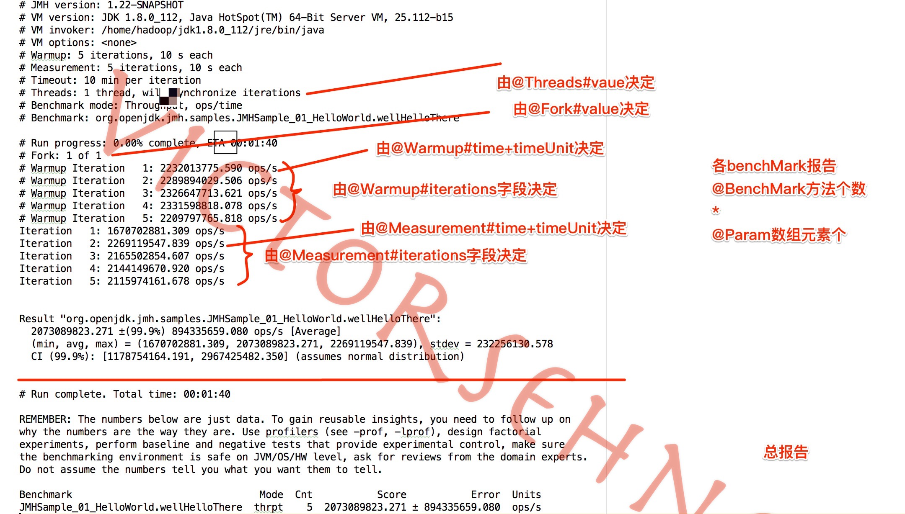

# 简介
对任何想到的,进行基准测试

## jmh-source
其中jmh-source从[官网](https://hg.openjdk.java.net/code-tools/jmh/)下载而来

hf clone https://hg.openjdk.java.net/code-tools/jmh 下载 

### jmh-core
做了一些中文注释
### jmh-samples
- [samples目录](jmh-source/jmh-samples/src/main/java/org/openjdk/jmh/samples/README.md)
- [logs目录](jmh-source/jmh-samples/logs)目录保存了样例的运行结果

# 我理解的jmh架构

## 整体架构

## 注解说明

# 参考
## 官网说明
https://openjdk.java.net/projects/code-tools/jmh/

## 更新日志
https://hg.openjdk.java.net/code-tools/jmh/shortlog

## 讨论
https://bugs.openjdk.java.net/projects/CODETOOLS/issues/CODETOOLS-7901999?filter=allopenissues

## 详细的英文参数介绍
https://github.com/Valloric/jmh-playground
