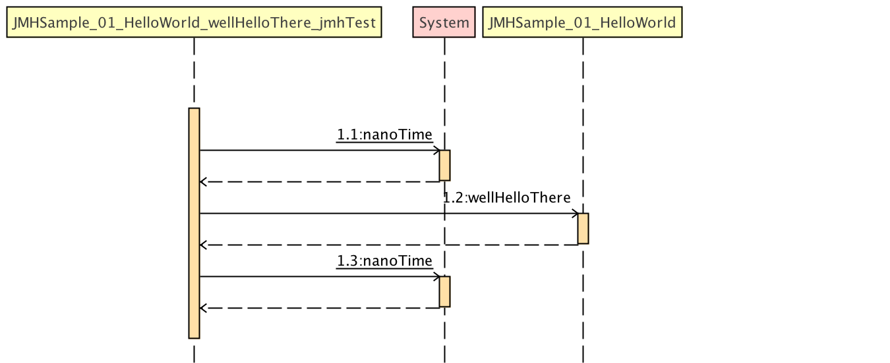

# 简介


## 来源
其中jmh-source从[官网](https://hg.openjdk.java.net/code-tools/jmh/)下载而来

hf clone https://hg.openjdk.java.net/code-tools/jmh 下载 

# 运行样例程序

## **36个样例程序:**
- [samples目录](jmh-samples/src/main/java/org/openjdk/jmh/samples/README.md)

## **运行结果:**
- [logs目录](jmh-samples/logs)目录保存了样例的运行结果


## 生成的测试代码在target/generateted-sources/annotations/目录下
以JMHSample_01_HelloWorld为例

- [JMHSample_01_HelloWorld_jmhType.java](jmh-samples/src/main/java/org/openjdk/jmh/samples/generated/sample01/JMHSample_01_HelloWorld_jmhType.java)
- [JMHSample_01_HelloWorld_jmhType_B1.java](jmh-samples/src/main/java/org/openjdk/jmh/samples/generated/sample01/JMHSample_01_HelloWorld_jmhType_B1.java)
- [JMHSample_01_HelloWorld_jmhType_B2.java](jmh-samples/src/main/java/org/openjdk/jmh/samples/generated/sample01/JMHSample_01_HelloWorld_jmhType_B2.java)
- [JMHSample_01_HelloWorld_jmhType_B3.java](jmh-samples/src/main/java/org/openjdk/jmh/samples/generated/sample01/JMHSample_01_HelloWorld_jmhType_B3.java)
- [JMHSample_01_HelloWorld_wellHelloThere_jmhTest.java](jmh-samples/src/main/java/org/openjdk/jmh/samples/generated/sample01/JMHSample_01_HelloWorld_wellHelloThere_jmhTest.java)


# 目录结构

##  jmh-samples包:
刚才运行的36个样例程序

##  jmh-core包:
提供了运行的api,可以再junittest或者main方法中进行调用

做了一些中文注释

##  jmh-jmh-generator-annprocess包
当java编译时,扫描到jmh的注解,触发org.openjdk.jmh.generators.BenchmarkProcessor类工作

### 触发机制:
- org.openjdk.jmh.generators.BenchmarkProcessor 继承 javax.annotation.processing.AbstractProcessor
- META-INF/services/javax.annotation.processing.Processor中注册了org.openjdk.jmh.generators.BenchmarkProcessor

## jmh-jmh-generator-bytecode
通过JmhBytecodeGenerator的main方法生成
scala,grooby,kotlin都是通过这个入口生成的测量代码

```
        BenchmarkGenerator gen = new BenchmarkGenerator();
        gen.generate(source, destination);
        gen.complete(source, destination);
```

## jmh-jmh-generator-asm
以asm为实现,生成字节码
```
            ASMGeneratorSource src = new ASMGeneratorSource();
            src.processClasses(classes);
            source = src;
```

## jmh-jmh-generator-reflection
以反射为实现,生成字节码
```
            RFGeneratorSource src = new RFGeneratorSource();
            for (File f : classes) {
                String name = f.getAbsolutePath().substring(compiledBytecodeDirectory.getAbsolutePath().length() + 1);
                name = name.replaceAll("\\\\", ".");
                name = name.replaceAll("/", ".");
                if (name.endsWith(".class")) {
                    src.processClasses(Class.forName(name.substring(0, name.length() - 6), false, amendedCL));
                }
            }
            source = src;
```

## jmh-core-it
pom文件中定义了三个profile,分别是:
- default:jmh-generator-annprocess
- asm
- reflection
测试核心的注释
```` 
benchmark
blackhole
collisions
exceptions
multsession
other
params
states
````


## jmh-core-ct
pom文件中定义了三个profile,分别是:
- default:jmh-generator-annprocess
- asm
- reflection

测试其他的注释
```
annsteal
asymm
auxcounters
batchsize
bulkwarmup
ccontrol
control
dagorder
errors
fails
footprint
fork
infraparams
interorder
intraorder
parameters
params
profilers
races
result
security
sharing
synciter
threadparams
threads
times 
```

## jmh-core-benchmarks
这个测试显示了可以测量的最小单个时间。这通常只影响采样时间和单一基准模式。吞吐量/ AverageTime测试可以做得更好，因为它们在完整的迭代之前和之后只执行一些时间戳。

## jmh-archetypes
包含groovy,java,kotlin,scala语言的模板工程


## jmh-ant-sample
ant集成jmh框架


# 我理解的jmh架构

## 运行时架构图


## 注解说明


## uml类图
首先是入口类Runner:

ForkedMain类:


## 代码分析

### 生成测试代码


### 入口方法:

首先调用run方法

调用internalRun方法

调用runBenchmarks方法

fork的话调用runSeparate方法

无fork调用runBenchmarksEmbedded方法


### forked进程启动 直至反射调用生成的代码:
forked子进程的入口方法

调用org.openjdk.jmh.runner.ForkedRunner.run方法(时序图省略)
调用org.openjdk.jmh.runner.BaseRunner.runBenchmarksForked方法(时序图省略)
调用org.openjdk.jmh.runner.BaseRunner.doSingle方法(时序图省略)
调用org.openjdk.jmh.runner.BaseRunner.runBenchmark方法


```
protected void runBenchmark(BenchmarkParams benchParams, BenchmarkHandler handler, IterationResultAcceptor acceptor) {
        long warmupTime = System.currentTimeMillis();

        long allWarmup = 0;
        long allMeasurement = 0;

        // warmup热身
        IterationParams wp = benchParams.getWarmup();
        for (int i = 1; i <= wp.getCount(); i++) {
            // will run system gc if we should
            if (runSystemGC()) {
                out.verbosePrintln("System.gc() executed");
            }

            out.iteration(benchParams, wp, i);
            boolean isLastIteration = (benchParams.getMeasurement().getCount() == 0);
            IterationResult ir = handler.runIteration(benchParams, wp, isLastIteration);
            out.iterationResult(benchParams, wp, i, ir);

            allWarmup += ir.getMetadata().getAllOps();
        }

        long measurementTime = System.currentTimeMillis();

        // measurement测量
        IterationParams mp = benchParams.getMeasurement();
        for (int i = 1; i <= mp.getCount(); i++) {
            // will run system gc if we should
            if (runSystemGC()) {
                out.verbosePrintln("System.gc() executed");
            }

            // run benchmark iteration
            out.iteration(benchParams, mp, i);

            boolean isLastIteration = (i == mp.getCount());
            IterationResult ir = handler.runIteration(benchParams, mp, isLastIteration);
            out.iterationResult(benchParams, mp, i, ir);

            allMeasurement += ir.getMetadata().getAllOps();

            if (acceptor != null) {
                acceptor.accept(ir);
            }
        }

        long stopTime = System.currentTimeMillis();

        BenchmarkResultMetaData md = new BenchmarkResultMetaData(
                warmupTime, measurementTime, stopTime,
                allWarmup, allMeasurement);

        if (acceptor != null) {
            acceptor.acceptMeta(md);
        }
    }
```
热身和测量分别调用两次runIteration方法

```
/**
     * Runs an iteration on the handled benchmark.
     * 迭代级别执行,既可以是热身,也可以是真实测量
     *
     * @param benchmarkParams Benchmark parameters
     * @param params  Iteration parameters
     * @param last    Should this iteration considered to be the last
     * @return IterationResult
     */
    public IterationResult runIteration(BenchmarkParams benchmarkParams, IterationParams params, boolean last) {
        int numThreads = benchmarkParams.getThreads();
        //iteration执行时间
        TimeValue runtime = params.getTime();

        CountDownLatch preSetupBarrier = new CountDownLatch(numThreads);
        CountDownLatch preTearDownBarrier = new CountDownLatch(numThreads);

        // result object to accumulate the results in
        List<Result> iterationResults = new ArrayList<>();

        InfraControl control = new InfraControl(benchmarkParams, params,
                preSetupBarrier, preTearDownBarrier, last,
                new Control());

        // preparing the worker runnables
        BenchmarkTask[] runners = new BenchmarkTask[numThreads];
        for (int i = 0; i < runners.length; i++) {
            runners[i] = new BenchmarkTask(control);
        }
        //benchmarkParams级别的timeout
        long waitDeadline = System.nanoTime() + benchmarkParams.getTimeout().convertTo(TimeUnit.NANOSECONDS);

        // profilers start way before the workload starts to capture
        // the edge behaviors.
        startProfilers(benchmarkParams, params);

        // submit tasks to threadpool 提交任务到线程池
        List<Future<BenchmarkTaskResult>> completed = new ArrayList<>();
        CompletionService<BenchmarkTaskResult> srv = new ExecutorCompletionService<>(executor);
        for (BenchmarkTask runner : runners) {
            srv.submit(runner);
        }

        // wait for all workers to transit to measurement
        control.awaitWarmupReady();

        // wait for the iteration time to expire
        switch (benchmarkParams.getMode()) {
            case SingleShotTime:
                // don't wait here, block on timed result Future
                break;
            default:
                try {
                    //poll = 轮训
                    //等待runtime 的时间,此时得到的一定是发生错误的,正常的还在while true中执行
                    Future<BenchmarkTaskResult> failing = srv.poll(runtime.convertTo(TimeUnit.NANOSECONDS), TimeUnit.NANOSECONDS);
                    if (failing != null) {
                        // Oops, some task has exited prematurely, without isDone check.
                        // Must be an exception. Record the failing result, and lift the
                        // timeout deadline: we care only to exit as fast as possible now.
                        completed.add(failing);
                        waitDeadline = System.nanoTime();
                    }
                } catch (InterruptedException e) {
                    // regardless...
                }
        }

        // now we communicate all worker threads should stop
        //宣布完成,此时内部的do {xxx} while(!isDone) while会跳出
        control.announceDone();

        // wait for all workers to transit to teardown
        control.awaitWarmdownReady();

        // Wait for the result, handling timeouts
        while (completed.size() < numThreads) {
            try {
                long waitFor = Math.max(TimeUnit.MILLISECONDS.toNanos(100), waitDeadline - System.nanoTime());
                //poll:获取future,可以等一会
                Future<BenchmarkTaskResult> fr = srv.poll(waitFor, TimeUnit.NANOSECONDS);
                if (fr == null) {
                    // We are in the timeout mode now, kick all the still running threads.
                    out.print("(*interrupt*) ");
                    for (BenchmarkTask task : runners) {
                        Thread runner = task.runner;
                        if (runner != null) {
                            runner.interrupt();
                        }
                    }
                } else {
                    completed.add(fr);
                }
            } catch (InterruptedException ex) {
                throw new BenchmarkException(ex);
            }
        }

        // Process the results: we get here after all worker threads have quit,
        // either normally or abnormally. This means, Future.get() would never block.
        long allOps = 0;
        long measuredOps = 0;

        List<Throwable> errors = new ArrayList<>();
        //收取结果
        for (Future<BenchmarkTaskResult> fr : completed) {
            try {
                BenchmarkTaskResult btr = fr.get();
                iterationResults.addAll(btr.getResults());
                allOps += btr.getAllOps();
                measuredOps += btr.getMeasuredOps();
            } catch (ExecutionException ex) {
                // unwrap: ExecutionException -> Throwable-wrapper -> InvocationTargetException
                Throwable cause = ex.getCause().getCause().getCause();

                // record exception, unless it is the assist exception
                if (!(cause instanceof FailureAssistException)) {
                    errors.add(cause);
                }
            } catch (InterruptedException ex) {
                // cannot happen here, Future.get() should never block.
                throw new BenchmarkException(ex);
            }
        }

        IterationResult result = new IterationResult(benchmarkParams, params, new IterationResultMetaData(allOps, measuredOps));
        result.addResults(iterationResults);

        // profilers stop when after all threads are confirmed to be
        // finished to capture the edge behaviors; or, on a failure path
        stopProfilers(benchmarkParams, params, result);

        if (!errors.isEmpty()) {
            throw new BenchmarkException("Benchmark error during the run", errors);
        }

        return result;
    }
```
通过线程池调用BenchmarkTask的call方法


```
class BenchmarkTask implements Callable<BenchmarkTaskResult> {
        private volatile Thread runner;
        private final InfraControl control;

        BenchmarkTask(InfraControl control) {
            this.control = control;
        }

        @Override
        public BenchmarkTaskResult call() throws Exception {
            try {
                // bind the executor thread
                runner = Thread.currentThread();

                // go for the run
                ThreadData td = threadData.get();
                //开始调用jmh 生成的代码
                return (BenchmarkTaskResult) method.invoke(td.instance, control, td.params);
            } catch (Throwable e) {
                // about to fail the iteration;
                //失败处理

                // notify other threads we have failed
                control.isFailing = true;

                // compensate for missed sync-iteration latches, we don't care about that anymore
                control.preSetupForce();
                control.preTearDownForce();
                if (control.benchmarkParams.shouldSynchIterations()) {
                    try {
                        control.announceWarmupReady();
                    } catch (Exception e1) {
                        // more threads than expected
                    }

                    try {
                        control.announceWarmdownReady();
                    } catch (Exception e1) {
                        // more threads than expected
                    }
                }

                throw new Exception(e); // wrapping Throwable
            } finally {
                // unbind the executor thread
                runner = null;
            }
        }
    }
```

### 反射调用测量执行方法:wellHelloThere_Throught

```
public BenchmarkTaskResult wellHelloThere_Throughput(InfraControl control, ThreadParams threadParams) throws Throwable {
        this.benchmarkParams = control.benchmarkParams;
        this.iterationParams = control.iterationParams;
        this.threadParams    = threadParams;
        this.notifyControl   = control.notifyControl;
        if (this.blackhole == null) {
            this.blackhole = new Blackhole("Today's password is swordfish. I understand instantiating Blackholes directly is dangerous.");
        }
        if (threadParams.getSubgroupIndex() == 0) {
            RawResults res = new RawResults();
            JMHSample_01_HelloWorld_jmhType l_jmhsample_01_helloworld0_0 = _jmh_tryInit_f_jmhsample_01_helloworld0_0(control);

            control.preSetup();


            control.announceWarmupReady();
            //如果需要虚拟同步的话,可以多执行几次(开始阶段)
            while (control.warmupShouldWait) {
                l_jmhsample_01_helloworld0_0.wellHelloThere();
                res.allOps++;
            }

            notifyControl.startMeasurement = true;
            //这个才是 真正的测量方法调用
            wellHelloThere_thrpt_jmhStub(control, res, benchmarkParams, iterationParams, threadParams, blackhole, notifyControl, startRndMask, l_jmhsample_01_helloworld0_0);
            notifyControl.stopMeasurement = true;
            control.announceWarmdownReady();
            try {
                //如果需要虚拟同步的话,可以多执行几次(结束阶段)
                while (control.warmdownShouldWait) {
                    //调用用户所测试的代码
                    l_jmhsample_01_helloworld0_0.wellHelloThere();
                    //ops计数
                    res.allOps++;
                }
                control.preTearDown();
            } catch (InterruptedException ie) {
                control.preTearDownForce();
            }

            if (control.isLastIteration()) {
                f_jmhsample_01_helloworld0_0 = null;
            }
            res.allOps += res.measuredOps;
            int batchSize = iterationParams.getBatchSize();
            int opsPerInv = benchmarkParams.getOpsPerInvocation();
            res.allOps *= opsPerInv;
            res.allOps /= batchSize;
            res.measuredOps *= opsPerInv;
            res.measuredOps /= batchSize;
            BenchmarkTaskResult results = new BenchmarkTaskResult(res.allOps, res.measuredOps);
            results.add(new ThroughputResult(ResultRole.PRIMARY, "wellHelloThere", res.measuredOps, res.getTime(), benchmarkParams.getTimeUnit()));
            this.blackhole.evaporate("Yes, I am Stephen Hawking, and know a thing or two about black holes.");
            return results;
        } else
            throw new IllegalStateException("Harness failed to distribute threads among groups properly");
    }
```
调用wellHelloThere_thrpt_jmhStub方法

```
    public static void wellHelloThere_thrpt_jmhStub(InfraControl control, RawResults result, BenchmarkParams benchmarkParams, IterationParams iterationParams, ThreadParams threadParams, Blackhole blackhole, Control notifyControl, int startRndMask, JMHSample_01_HelloWorld_jmhType l_jmhsample_01_helloworld0_0) throws Throwable {
        long operations = 0;
        long realTime = 0;
        result.startTime = System.nanoTime();
        do {
            l_jmhsample_01_helloworld0_0.wellHelloThere();
            operations++;
        } while(!control.isDone);
        result.stopTime = System.nanoTime();
        result.realTime = realTime;
        result.measuredOps = operations;
    }
```
## 设计模式
主入口:org.openjdk.jmh.runner.Runner类的run方法
forked入口:org.openjdk.jmh.runner.ForkedRunner.run方法
Runner和ForkedRunner都是继承BaseRunner,保证了不管是否forked,调用的是相同代码


# 参考
## 官网说明
https://openjdk.java.net/projects/code-tools/jmh/

## 更新日志
https://hg.openjdk.java.net/code-tools/jmh/shortlog

## 讨论
https://bugs.openjdk.java.net/projects/CODETOOLS/issues/CODETOOLS-7901999?filter=allopenissues

## 详细的英文参数介绍
https://github.com/Valloric/jmh-playground
